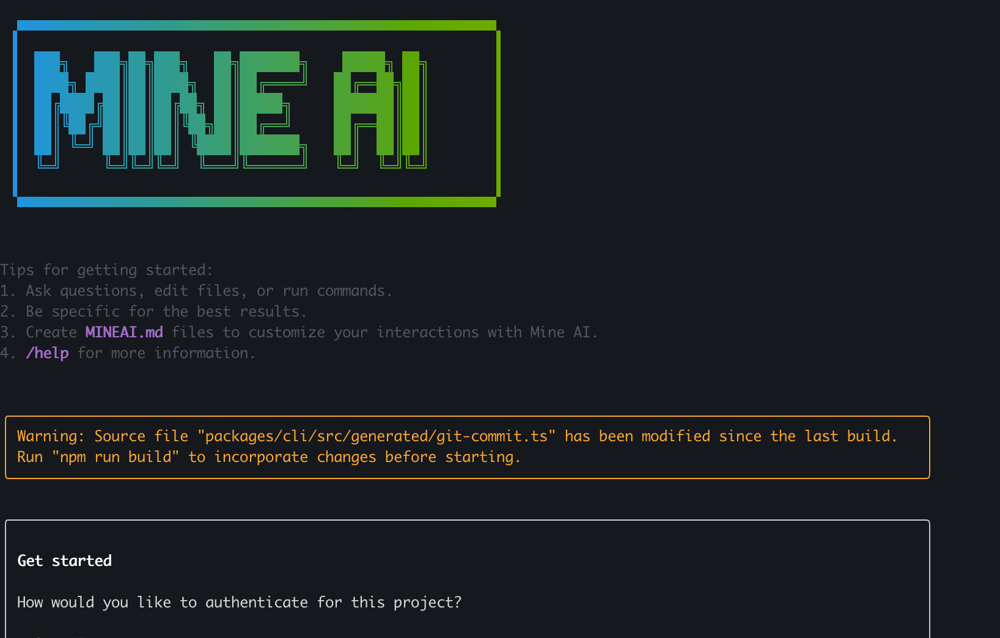

# Mine AI



Mine AI is a command-line AI workflow tool adapted from [**Gemini CLI**](https://github.com/google-gemini/gemini-cli)(Please refer to [this document](./README.gemini.md) for more details), optimized for [Kimi-K2](https://huggingface.co/moonshotai/Kimi-K2-Instruct) models with enhanced parser support & tool support.

## Key Features

- **Code Understanding & Editing** - Query and edit large codebases beyond traditional context window limits
- **Workflow Automation** - Automate operational tasks like handling pull requests and complex rebases
- **Enhanced Parser** - Adapted parser specifically optimized for Kimi-K2 models

## Quick Start

### Prerequisites

Ensure you have [Node.js version 20](https://nodejs.org/en/download) or higher installed.

```bash
curl -qL https://www.npmjs.com/install.sh | sh
```

### Installation

```bash
npm install -g @mine-ai/mine-ai
mineai --version
```

Then run from anywhere:

```bash
mineai
```


### API Configuration

#### Option 1: Mine AI API (Default)
Set your Mine AI API key (In Mine AI project, you can also set your API key in `.env` file):

```bash
export MINEAI_API_KEY="your_api_key_here"
export MINEAI_BASE_URL="your_api_base_url_here"
export OPENAI_MODEL="moonshotai/Kimi-K2-Instruct"
```

#### Option 2: HuggingFace Kimi K2 with Proxy Platform
For using HuggingFace Kimi K2 model through HuggingFace Router:

```bash
export HUGGINGFACE_API_KEY="your_huggingface_api_key"
export HUGGINGFACE_BASE_URL="https://router.huggingface.co/v1"
export OPENAI_MODEL="moonshotai/Kimi-K2-Instruct:novita"
```

Available providers for Kimi K2:
- `moonshotai/Kimi-K2-Instruct:novita`
- `moonshotai/Kimi-K2-Instruct:fireworks-ai`
- `moonshotai/Kimi-K2-Instruct:together`
- `moonshotai/Kimi-K2-Instruct:groq`

Or use a custom proxy platform directly:

```bash
export PROXY_API_KEY="your_proxy_api_key"
export PROXY_BASE_URL="your_proxy_platform_base_url"
export OPENAI_MODEL="moonshotai/Kimi-K2-Instruct"
```

## Node Operation Examples (TDB)

TDB

## Benchmark Results

### Terminal-Bench

| Agent     | Model              | Accuracy |
|-----------|--------------------|----------|
| Mine AI | moonshotai/Kimi-K2-Instruct | 37.5     |


## License

[LICENSE](./LICENSE)
